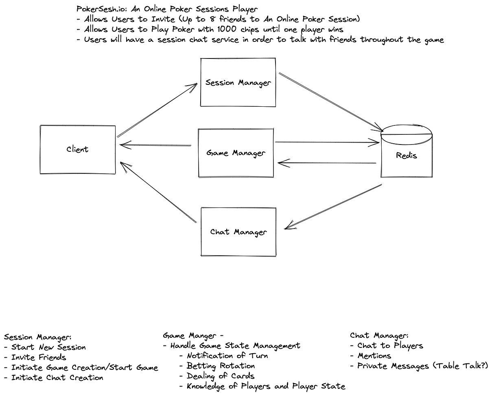

# PokerSesh.io
Session Based Online Poker for Friends

## Description
PokerSesh.io: An Online Poker Sessions Player
- Allows Users to Invite (Up to 8 friends to An Online Poker Session)
- Allows Users to Play Poker with 1000 chips until one player wins
- Users will have a session chat service in order to talk with friends throughout the game

## Design
- The overall design consist of three different servers that work together in order to provide 
    - Session Manager:
        - Allows Users to Create a Session
        - Generates a Unique Url for others users to join
        - Once 2+ users are in the game, the ability will be exposed for the Host to create the game
    - Game Manager:
        - The host for the poker game
        - The Manager will handle bidirectional messages between the client's and the game itself
            - Notifies users of turn
            - Handling of the turns themselves
            - Handling of betting
    - Chat Manager:
        - The chat host for the session
        - Once a session is created a new chat host will be created
        - Although the chat manager will not store any information on what the chat pertained it will pass the messages back and forth between the client's

